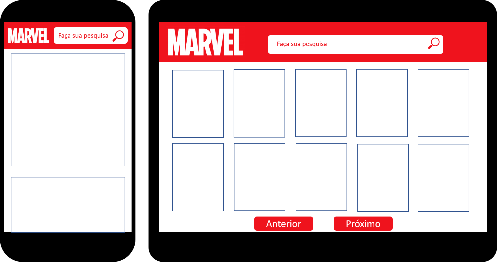
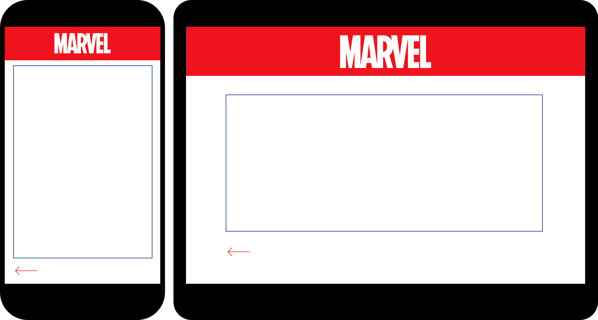

# Desafio-Dextra

## Desafio

Queremos que você desenvolva um catálogo de quadrinhos da Marvel Comics, e, para isso será necessário que você desenvolva o front-end desta aplicação.  
A Marvel Comics disponibiliza uma API onde estes dados podem ser encontrados, você deve se registrar na plataforma da Marvel para ter acesso a sua API, de forma gratuita, através do link:

https://developer.marvel.com.

#### Requisitos necessários:

- Listagem dos quadrinhos
- Título, imagem, thumbnail e autores
- Paginação dos quadrinhos
- Grid dos quadrinhos em 10 e 10
- Pesquisa por personagem
- Pesquisa através do nome do personagem em inglês
- Detalhe dos quadrinhos
- Botão ou mecanismo similar para abertura de uma nova página com detalhes do quadrinho

#### Extras:

- Boas práticas de codificação
- Cobertura de testes
- Aplicação responsiva

# 1ª Versão entregue em 07/10

## Planejamento

#### História de Usuário

Separado os Requisitos Necessários em pequenas Histórias de Usuário:

- 1º: Como usuário quero acessar a tela inicial e ver os quadrinhos exibidos em grid de 10 em 10.
- 2º: como usuário quero clicar em um quadrinho e ter acesso a mais informações sobre o mesmo.
- 3º: Como usuário quero realizar pesquisar por nome de personagens em inglês, e deve me retornar todos os quadrinhos, também exibidos em grid de 10 em 10 daquele personagem.

#### Protótipo

Protótipo de baixa fidelidade:

## O que foi entregue

- Histórias de Usuários completas
- Responsividade

#### Link da Aplicação

Acesse o Catálogo da Marvel:

https://jessicamelise.github.io/Desafio-Dextra/

## Implementações Futuras

- Testes
- Refatoração do código
- Adição de biblioteca para CSS
- Correção de bug da página de pesquisa detalhada que está voltando sempre para a tela inicial da pesquisa
- Deixar HTML mais semântico
- Colocar condição de esconder botão Next na lista de comics geral quando chegar na última página

## Autor
Jéssica Melise